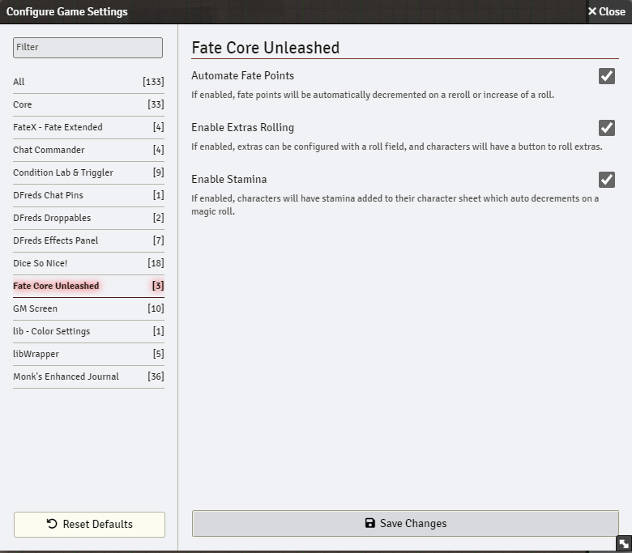

  

<h1 align="center">Fate Core Unleashed</h1>

<h4 align="center">
  <a href="https://foundryvtt.com/packages/fate-core-unleashed">Install</a>
  ·
  <a href="https://discord.gg/Wq8AEV9bWb">Discord</a>
  ·
  <a href="https://dfreds-modules.com">Other Modules</a>
</h4>

    
    
    
     
     
    
    
     
    
    
     
     
    
    
     
     
    

    <b>Fate Core Unleashed</b> is a FoundryVTT module that adds additional
    features to the FateX system.

## Features

- Adds stamina management to character sheets
- Automatically decrements stamina when performing configured "magic" rolls
- Automatically decrement fate points when modifying a roll via a re-roll or increase when the shift key is held down
- Adds configurable roll expressions to Extra items (e.g. "4dF+2")
- Adds one-click roll button to Extra items for quick access

Fate Point Automation:

Stamina:

Extras rolling:

Settings:

